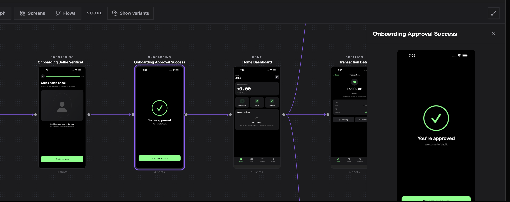
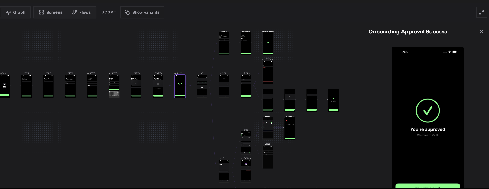
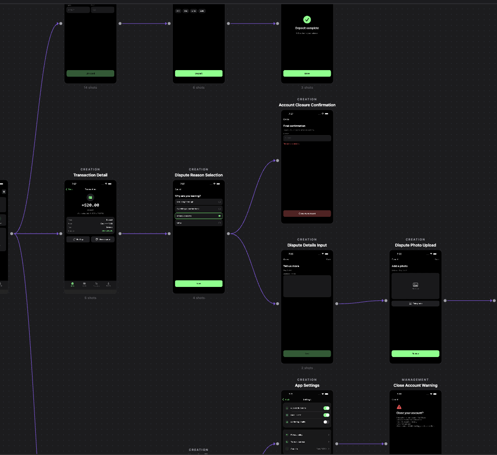

# jsxray — product spec

> Status legend used throughout: **✅ built** · **◐ partial** · **⬜ planned**

---

## 1. What it is

A CLI that reads a react project (in the future, it has to support react native, vue etc, so the architecture has to be provider based), drives the running app, and produces an
interactive map of every screen wired to the components that build it.

```
jsxray run     # read code to understand page flows (static) + drive the app to capture screenshots (runtime) → .jsxray/
jsxray view    # open the canvas over .jsxray/jsxray.json and show the screenshots in react flow
```




The output is a **flow canvas**: every screen as a framed screenshot, laid out in
the order a person moves through them. For eg. in a screen, if there is a form, we move through by filling it and clicking on submit so that it takes us to the next screen.

Additional scopes: maybe part of v2. 
1. with each screen's design-system
composition attached and every rendered element traceable back to source.
2. support vue, react native etc

## 2. Who it is for

**Third-party developers running it on their own codebase.** jsxray has never
seen the app before run time. Therefore:

- Analysis must be automatic — no annotation, no instrumentation of app code.
- Analysis must understand whether the app uses next, vite etc (and which router etc.)
- App-specific glue must be small, declarative, and mostly scaffolded (`init`).
- Every stage must degrade rather than fail on an unfamiliar shape.

Secondary readers of the output: designers auditing the flow,
engineers onboarding to an unfamiliar app, and (later)
design system audit + LLMs consuming
`jsxray.json` directly.

## 3. Jobs to be done

| # | Job | Answered by |
|---|---|---|
| J1 | "Show me every screen in this app" | `screens`, captured during a crawl |
| J2 | "How do I get from A to B?" | `edges` — navigation, runtime-confirmed |
| J3 | "What does an admin see here that a normal user doesn't?" | per-persona variants + conditional guards |
| J4 | "Which design-system primitives does this screen use?" | per-screen component tree, design-system marks |
| J5 | "What does this rectangle on screen correspond to in source?" | `boxes` — rect → component → source location |
| J6 | "What changed since last release?" | two `jsxray.json` files diffed |

J1–J2 are the v1 promise. J3 is designed for but needs the runtime. J4, J5 and J6 is
a consequence of the document being versioned and deterministic, so maybe v2.

## 4. Non-goals

- **Not a dev-server manager.** jsxray never boots the app. `.env`, build
  config, and monorepo wiring stay the user's problem. It points at a URL.
- **Not a test runner.** It observes; it does not assert.
- **Not a design tool.** It maps what exists; it does not propose changes.
- **Not a coverage tool for code.** Screen coverage, not line coverage.
- **Not a screenshot-diffing service** in v1, though the output is built to
  make that possible later.

## 5. The core loop

```
1. jsxray init     scaffold jsxray.config.ts from the detected stack    ✅
2. (set credential env vars)
3. jsxray run      code → .jsxray/jsxray.json, then drive the app → captures  ◐
4. jsxray view     open the canvas                                       ✅
```

Step 3 is one command with two halves. The static half needs nothing but
source. The runtime half needs a running URL and credentials.

## 6. User-facing surface

### 6.1 Commands

| Command | Purpose | Status |
|---|---|---|
| `jsxray run` | source → `.jsxray/jsxray.json`; with the runtime half, adds captures (`.jsxray/assets/`) and boxes | ◐ static only |
| `jsxray view` | serve the canvas and open a browser | ✅ |
| `jsxray view --list` | text listing, for CI logs and terminals | ✅ |
| `jsxray view --export <file>` | canvas + document as one self-contained HTML file | ✅ |
| `jsxray init` | scaffold `jsxray.config.ts` from the detected stack | ✅ |

### 6.2 Config

`jsxray.config.ts` lives in the target app. Everything has a default; the file
exists for what cannot be inferred: the URL, credentials, named flows, and
exclusions.

```ts
export default defineConfig({
  url: 'http://localhost:3000',
  personas: [
    { id: 'anon' },                                     // no login — a persona, not an absence
    { id: 'user',  login: { username: env('USER_EMAIL'),  password: env('USER_PW') } },
    { id: 'admin', login: { username: env('ADMIN_EMAIL'), password: env('ADMIN_PW') } },
  ],
  loginFlow: { start: '/login', steps: [ /* fill / tap */ ] },  // the auth provider's script
  flows: [ /* named deep-path flows */ ],
  seedRoutes: ['/', '/dashboard'],
  capture: { delayMs: 2000 },             // hold before the shutter, so skeletons resolve
  ignore: {
    navigation:   ['**/beta'],            // never click
    screenshots: ['/settings/secrets'],     // visit ok, never capture — privacy
    actions: ['**/logout'], // no actions, for safety
  },
});
```

## 7. The canvas

The canvas is the product for most readers, so its visual language is spec, not
styling.

| Element | Rule |
|---|---|
| **Node** | **One state, not one screen** — a screen with a modal open is a second node. A device frame; phone for native targets, browser for web. Reader can override the frame. |
| **Frame contents** | The screen capture strictly, taken once the screen's data has arrived — not the skeleton it shows while loading. |
| **Eyebrow** | Section label above the frame, small uppercase, letterspaced. Sourced from the router's own grouping (a Next route group), falling back to the parent path segment. |
| **Title** | Human-readable screen name; for a modal state, the modal's own name. |
| **Edge** | Curved, single arrowed. Only one edge even when several links share a pair. Drawn only when a link is established during runtime. **Labelled with the transition, not with the words on the control**: `Navigate to /profile/:name/feed/:rkey`, `Open the rename workspace dialog`, `Close the rename workspace dialog`. A button reading "View this user's verifications" is a good button and a bad edge label — on a line it is longer than the node it points at, and it names where the reader already is instead of where the line goes. The control's own words stay in the inspector and in `--list`. |
| **One line in** | Each screen shows **one** incoming line: the shortest way to reach it. If the map holds both `Home → Welcome → Dashboard` and `Home → Dashboard`, only `Home → Dashboard` is drawn. Longer ways in, links back to a screen already passed through, and self-loops are not drawn. All of them stay in the document and in the inspector; the toolbar reports how many lines were left out. |
| **Layout** | A **tree**, growing left to right. Every state is a consequence of the state before it, so depth reads left to right and the states reachable from one node fan out vertically, centred on it. Variants of a screen (settings with different modals open) are simply that node's children — no special case. Ideally no two edges cross; the tree shape is what makes that reachable. The gap between depths is wide — it carries the edge and its label — and the gap between siblings is tight, because it carries nothing. |
| **Chrome** | Dark ground, dot grid static regardless of zoom, vertical brand rail, square zoom controls bottom-left. |




### 7.1 Interactions

| Action | Result | Status |
|---|---|---|
| Pan / zoom / fit | Standard canvas navigation | ✅ |
| Click a screen | Inspector: route facts, component tree, guards, outgoing transitions | ✅ |
| Click a tree element | Props with values, source location, design-system origin, what it wraps | ✅ |
| Open the non-page list | Route handlers and error states, in a separate view — they render no UI, so they are never nodes (§11.2) | ✅ |
| Switch frame | phone / browser / auto | ✅ |
| Switch persona | Filter the canvas to one role | ⬜ needs captures |
| Click a box on a capture | Jump from a rendered rectangle to its component | ⬜ needs `link` |

### 7.2 The honesty rule

**The canvas never shows invented data.** Where a fact does not exist yet, the
canvas says plainly that the stage has not run. A disabled
persona selector is correct; a fabricated one is not.

## 8. Safety, privacy, determinism

These are product commitments, not implementation details.

- **Credentials are never persisted.** Config stores the *name* of an
  environment variable. Values are read at run time, held in memory, and never
  written to config, to `jsxray.json`, or to any log. ✅
- **Safe-crawl guard.** Never click logout, delete, pay, or similar during a
  flow — by href *and* by visible label. Protects the session and prevents
  destructive side effects. User rules extend the built-in denylist; they
  cannot replace it. ✅
- **Screenshots capture real authenticated data.** Users are told to use a test
  account without sensitive data. `ignore.screenshots` is a separate,
  privacy-only rule: those routes are still visited, never captured. ◐
- **Determinism.** Freeze animation, time, fonts, and randomness *before the app boots* — before
  login, not just before capture — so runs are reproducible and diffable. ⬜

## 9. Personas

A first-class dimension, not N separate maps. The same route renders
differently per role, so the pipeline runs per persona and a node holds
per-persona variants — one graph, with a persona toggle and diff badges.
**Logged-out is a persona**, not the absence of one; it is the role most apps
render most differently.

The static half already supports this: every JSX element records the condition
gating it (`{isAdmin && <AdminPanel/>}`) with source location and the
identifiers it depends on. The runtime half supplies the evidence of what each
persona actually saw. ◐

## 10. Success criteria

| Measure | Target | Now |
|---|---|---|
| Runs on an unseen React repo with zero config | no crash, no unhandled warnings | ⬜ |
| Screens found ÷ screens that exist | 100% of file-based routes | ⬜ |
| Screens reached at runtime ÷ screens declared | ≥ 80% on a repo with a test account | ⬜ |
| Declared links confirmed at runtime ÷ links that could be matched | ≥ 60% | ⬜ |
| Two runs of the same commit produce identical captures | byte-identical | ⬜ |
| JSX tied to a component or package | ≥ 95% *(v2)* | ⬜ |

## 11. Open product questions

1. **Does the canvas need grouping bands** (a labelled swimlane per section)
   rather than only per-node eyebrows?
   For now, per node
   In v2, clusters and swimlanes
      ╭┈┈ ONBOARDING ┈┈┈┈┈┈┈┈┈┈┈┈╮
      ┆ ┌────┐  ┌────┐  ┌────┐   ┆     ┌────┐
      ┆ │    │─▶│    │─▶│    │───┼────▶│    │
      ┆ └────┘  └────┘  └────┘   ┆     └────┘
      ╰┈┈┈┈┈┈┈┈┈┈┈┈┈┈┈┈┈┈┈┈┈┈┈┈┈┈╯
2. **Non-page screens** — belong in a different view.
